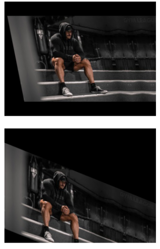
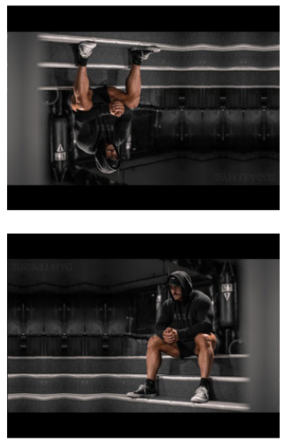
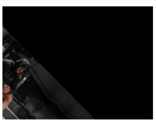

# Image-Transformation
## Aim
To perform image transformation such as Translation, Scaling, Shearing, Reflection, Rotation and Cropping using OpenCV and Python.

## Software Required:
Anaconda - Python 3.7

## Algorithm:
### Step1:
<br>Import the necessary libraries and read the original image and save it as a image variable.

### Step2:
<br>Define the variable M so that it can be used as map

### Step3:
<br>get the rows and coloumns of the image using shape() function in opencv

### Step4:
<br>Translate,scale,shear,reflection,rotation,cropping the image using the modules in opencv

### Step5:
<br>Display them through matplotlib

## Program:
```
Developed By:Kirupanandhan.T
Register Number:212221230051

import numpy as np
import cv2
import matplotlib.pyplot as plt
img=cv2.imread("input_image.jpg")
img=cv2.cvtColor(img,cv2.COLOR_BGR2RGB)
plt.axis('off')
plt.imshow(img)
plt.show()
rows,cols,dim=img.shape
i)Image Translation
M=np.float32([[1,0,20],
             [0,1,50],
             [0,0,1]])
translated_img=cv2.warpPerspective(img,M,(cols,rows))
plt.axis('off')
plt.imshow(translated_img)
plt.show()


ii) Image Scaling:

M=np.float32([[1.5,0,0],
             [0,2,0],
             [0,0,1]])
scaled_img=cv2.warpPerspective(img,M,(cols,rows))
plt.axis('off')
plt.imshow(scaled_img)
plt.show()


iii)Image shearing:

M_x=np.float32([[1,0.2,0],
               [0,1,0],
               [0,0,1]])
M_y=np.float32([[1,0,0],
               [0.4,1,0],
               [0,0,1]])
sheared_img_xaxis=cv2.warpPerspective(img,M_x,(cols,rows))
sheared_img_yaxis=cv2.warpPerspective(img,M_y,(cols,rows))
plt.axis('off')
plt.imshow(sheared_img_xaxis)
plt.show()
plt.axis('off')
plt.imshow(sheared_img_yaxis)
plt.show()

iv)Image Reflection:

M_x=np.float32([[1,0,0],
               [0,-1,rows],
               [0,0,1]])
M_y=np.float32([[-1,0,cols],
               [0,1,0],
               [0,0,1]])
reflected_img_xaxis=cv2.warpPerspective(img,M_x,(cols,rows))
reflected_img_yaxis=cv2.warpPerspective(img,M_y,(cols,rows))
plt.axis('off')
plt.imshow(reflected_img_xaxis)
plt.show()
plt.axis('off')
plt.imshow(reflected_img_yaxis)
plt.show()


v)Image Rotation: 

angle=np.radians(45)
M=np.float32([[np.cos(angle),-(np.sin(angle)),0],
               [np.sin(angle),np.cos(angle),0],
               [0,0,1]])
rotated_img=cv2.warpPerspective(img,M,(cols,rows))
plt.axis('off')
plt.imshow(rotated_img)
plt.show()


vi)Image Cropping:

cropped_img=img[10:950,100:1050]
plt.axis('off')
plt.imshow(cropped_img)
plt.show()


```
## Output:
### Original image:


### i)Image Translation


### ii) Image Scaling

<br>
<br>
<br>


### iii)Image shearing

<br>
<br>
<br>


### iv)Image Reflection

<br>
<br>
<br>


### v)Image Rotation:

<br>
<br>
<br>


### vi)Image Cropping


## Result: 

Thus the different image transformations such as Translation, Scaling, Shearing, Reflection, Rotation and Cropping are done using OpenCV and python programming.
